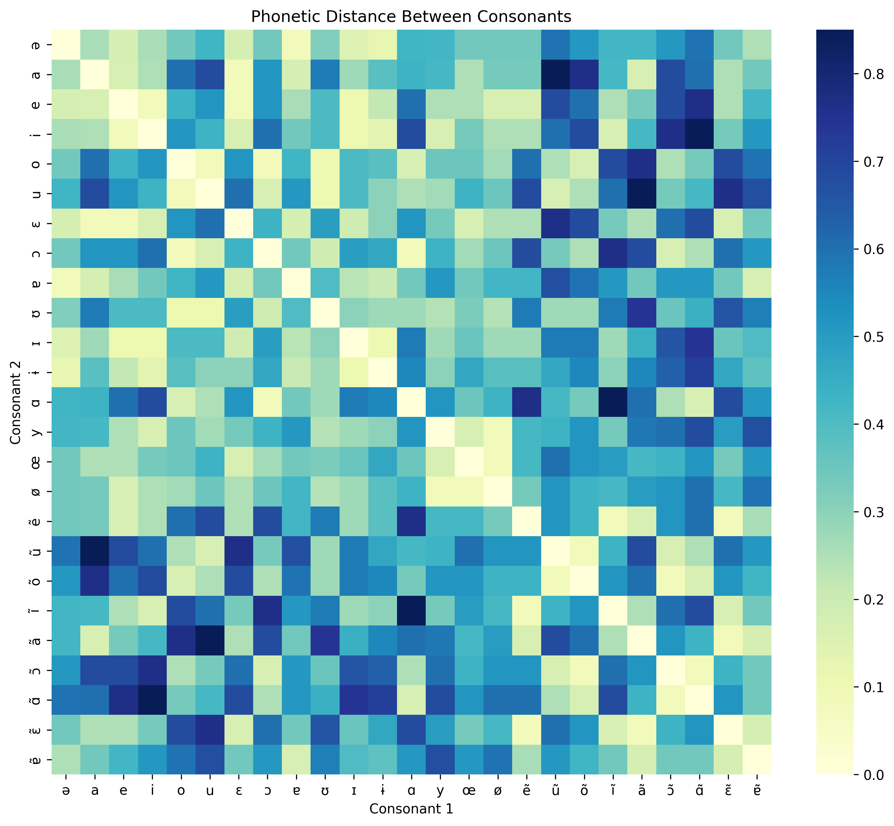
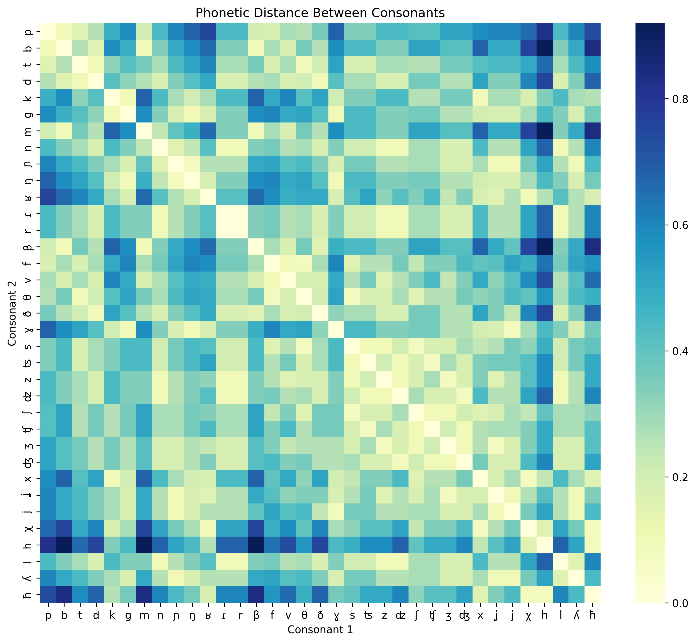

# Cognates Detection

## Overview
This project aims to detect cognates—words in different languages that share a common etymological origin. The approach includes:

1. **Extraction of words and phonetic transcriptions**, categorized by parts of speech.
2. **Computation of Levenshtein distance** to measure similarity.
3. **Analysis of vowel and consonant distributions** through heat maps.
4. **Weighted combination of phonetic and standard Levenshtein distances**, with language-specific adjustments.
5. **Thresholding to classify cognates**, identifying words with low distance values as similar or cognates.

## Methodology

### 1. Word and Transcription Extraction
- Words are extracted from linguistic corpora wiktionary.
- Phonetic transcriptions are generated using IPA (International Phonetic Alphabet) or language-specific rules.
- Words are categorized by parts of speech (nouns, verbs, adjectives, etc.).

### 2. Computing Levenshtein Distance
- **Standard Levenshtein Distance**: Measures character-level differences between two words.
- **Phonetic Levenshtein Distance**: Applied on phonetic transcriptions to capture pronunciation similarities.





### 3. Weighted Distance Model
- The final similarity score is computed as:
  
  ```
  Score = α * Phonetic Levenshtein + β * Standard Levenshtein
  ```
  
  - α and β are adjustable weights depending on language pairs.
  - Some languages have greater phonetic similarity (higher α), while others rely more on orthography (higher β).

### 4. Cognate Classification via Thresholding
- A **threshold value** determines whether words are cognates:
  
  - **Low distance → Cognates or highly similar words**
  - **High distance → Unrelated words**
  
- The optimal threshold varies per language and dataset.

## Usage
### Running the Detection Process
```bash
python main.py --input words.txt --output results.csv
```

### Adjusting Weights & Threshold
Modify the configuration file (`config.json`) to tweak α, β, and threshold values for specific languages.

### Generating Heat Maps
```bash
python generate_heatmaps.py --input data.csv --output heatmaps/
```

## Results & Observations
- Words with **Levenshtein distance < X** (depending on language) are classified as cognates.
- Languages with phonetic shifts require higher weight for phonetic distance.
- Heat maps provide insights into phonetic evolution between languages.

## Contributions
Feel free to submit pull requests or open issues for improvements!

